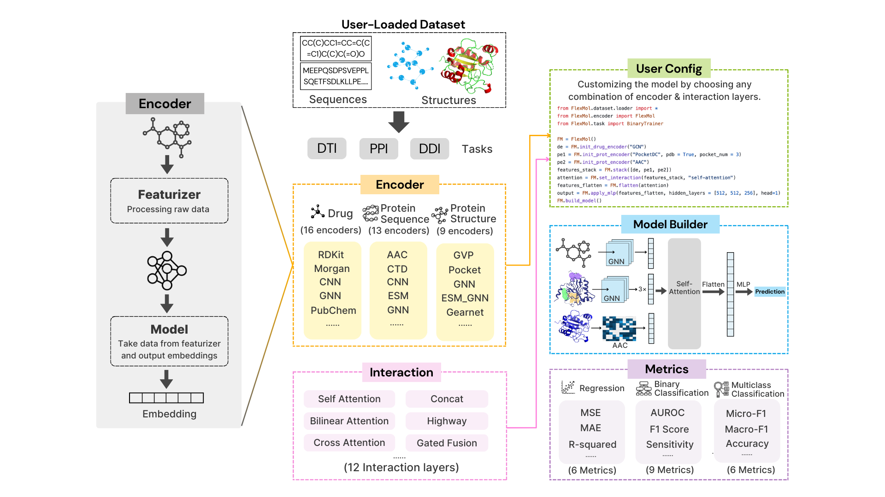

# FlexMol: A Flexible Toolkit for Benchmarking Molecular Relation Learning

## Overview

<p align="center">
  
</p>

FlexMol is a powerful and flexible toolkit designed to advance molecular relation learning (MRL) by enabling the construction and evaluation of diverse model architectures across various datasets and performance metrics. FlexMol aims to streamline the development process, reduce repetitive coding efforts, and ensure fair comparisons of different models.

FlexMol offers several unique features:
- **Dynamic and Flexible Model Construction:** Easily create over 70,000 distinct model architectures.
- **Comprehensive Data Support:** The first MRL toolkit to support encoders for protein structures, protein sequences, and drug data at the same time.
- **Advanced Interaction Layers:** The first MRL library to introduce interaction layers, enabling more sophisticated modeling of molecular relationships.
- **User-Friendly API:** Customize and develop models with just a few lines of code, making the process straightforward and efficient.
- **Versatile Task Handling:** Supports binary classification, regression, and multi-class classification tasks, covering a wide range of applications.
- **Customizable Encoders:** Create your own custom encoders and seamlessly integrate them with preset encoders to build unique models.

## Installation

### Build from Source

1. **Clone the Repository**

   ```bash
   git clone https://github.com/Steven51516/FlexMol.git
   cd flexmol
   ```

2. **Create a New Conda Environment**

   ```bash
    conda create --name flexmol_env python=3.8
    conda activate flexmol_env
   ```
2. **Install Dependencies**
   ```bash
   pip install -r requirements.txt
   ```

### Using `pip`

We plan to enable installation using pip for easier setup and dependency management. Stay tuned for updates!


## Tutorials

We provide tutorials to get started with FlexMol:

| Name  | Description                                             |
|-------|---------------------------------------------------------|
| [Dataloading1](tutorials/FlexMol_Dataloading.ipynb)   | Data Loading Techniques in FlexMol                             |
| [Dataloading2](tutorials/FlexMol_TDC_Interface_Demo.ipynb)   | Using FlexMol with TDC Interface                             |
| [101](tutorials/FlexMol_101_Encoder.ipynb)   | Introduce FlexMol Encoders                              |
| [102](tutorials/FlexMol_102_Dual_Encoder.ipynb)   | Build and train a simple Dual Encoders model                            |
| [103](tutorials/FlexMol_103_Multiple_Encoder.ipynb) | Build models with Multiple Encoders                |
| [104](tutorials/FlexMol_104_Interaction.ipynb) | Introduce Interaction Layers                     |
| [105](tutorials/FlexMol_105_Custom_Encoder.ipynb)   | Integration of User-Custom Encoders |
| [106](tutorials/FlexMol_106_Complex_Model.ipynb)   | Example of Building Complex Models                             |


## Model Building in FlexMol

The model building process in FlexMol is designed to be intuitive and flexible. This process is structured into three main steps:

### Step 1: Task Selection and Dataset Loading

Begin by selecting a specific task, which will guide you in loading the appropriate dataset tailored to your research needs. Refer to the tutorials for instructions on how to load from a custom dataset [here](tutorials/FlexMol_Dataloading.ipynb) or load from TDC [here](tutorials/FlexMol_TDC_Interface_Demo.ipynb).

Example code to load data into FlexMol:

```python
# Example code to load Drug-Target Interaction (DTI) data into a dataframe
# Load data into a dataframe with the columns: "Drug", "Protein", "Protein_ID (optional)", and "Y"
# The optional "Protein_ID" column can be included for 3D encoders that require PDB files as input.
DTI = load_DTI("data/toy_data/dti.txt", delimiter=" ")
print("Drug-Target Interaction data:")
print(DTI.head())
```

### Step 2: Model Customization
In the customization phase, users can define their model by choosing from FlexMol's extensive array of components. This includes the selection of. 
- 16 drug encoders
- 13 protein sequence encoders
- 9 protein structure encoders
- 7 interaction layers

#### Drug Encoders
| Encoder Type   | Models                        |
| -------------- | ----------------------------- |
| **Sequence**   | CNN, Transformer, Morgan, Daylight, ErG, PubChem, ChemBERTa, ESPF |
| **Graph 2D**   | GCN, MPNN, GAT, NeuralFP, AttentiveFP, GIN |
| **Graph 3D**   | SchNet, MGCN |

#### Protein Encoders
| Encoder Type   | Models                        |
| -------------- | ----------------------------- |
| **Sequence**   | CNN, Transformer, AAC, ESPF, PseudoAAC, Quasi-seq, Conjoint triad, ESM, ProtTrans-t5, ProtTrans-bert, ProtTrans-albert, Auto correlation, CTD |
| **Graph 3D**   | GCN, GAT, GIN, GCN_ESM, GAT_ESM, GIN_ESM, PocketDC, GVP, GearNet |

While FlexMol offers the ability to generate a vast array of models, it does not impose restrictions on the number of encoders and interaction layers used, providing users with limitless configuration possibilities. 

```python
from FlexMol.encoder import FlexMol

# Example code to build a simple DTI model using Transformer encoders for both drug and protein
FM = FlexMol()

# Initialize Transformer encoders for drug and protein without pooling
de = FM.init_drug_encoder("Transformer", pooling=False)
pe = FM.init_prot_encoder("Transformer", pooling=False)

# Set up the cross-attention interaction layer (requires pooling=False)
interaction_output = FM.set_interaction(
    [de, pe], 
    "cross_attention"
)

# Apply an MLP to the interaction output
output = FM.apply_mlp(interaction_output, head=1)

# Build the model
FM.build_model()
```


### Step 3: Model Construction and Training
Once the model is configured, FlexMol takes over the construction process. It automates the assembly of the model and manages all aspects of data processing and training. The built-in trainer is equipped with 21 metrics for evaluating performance.


```python

from FlexMol.task import BinaryTrainer

# Example code to train a DTI model on binary classification task
# Load the user-provided datasets for training, validation, and testing
train_df, val_df, test_df = ... 
# Initialize the user-customized FlexMol instance
FM = ... 

# Configure the BinaryTrainer with the FlexMol instance and training parameters
trainer = BinaryTrainer(
    FM,  
    task="DTI",
    test_metrics=["accuracy", "precision", "recall", "f1"],
    device="cpu",
    early_stopping="roc-auc",
    epochs=30,
    patience=10,
    lr=0.0001,
    batch_size=128
)

# Prepare the datasets for training, validation, and testing
train_data, val_data, test_data = trainer.prepare_datasets(train_df=train_df, val_df=val_df, test_df=test_df)

# Train the model using the training and validation datasets
trainer.train(train_data, val_data)

# Test the model using the test dataset
trainer.test(test_data)

# Save the trained model to the specified path
trainer.save_model("path/to/save/model.pth")
```

## Design of FlexMol

FlexMol is built on a flexible, modular framework designed to facilitate the dynamic construction of molecular relation models. This section introduces two fundamental components of the FlexMol architecture: Encoders and Interaction Layers.

### Encoder
The **Encoder** component in FlexMol is responsible for transforming raw molecular data into meaningful representations. It begins with preprocessing tasks managed by the **Featurizer** class, including tokenization, normalization, feature extraction, fingerprinting, and graph construction. The preprocessed data is then processed by the **Encode Layer**, which generates embeddings during model training and inferencing. 

### Interaction Layer
The **Interaction Layer** is crucial for capturing and modeling complex relationships between different molecular entities. Interaction layers can integrate inputs from various FlexMol components, including Encoder Layers and other Interaction Layers. 


## Contact

Reach us at [sliu0727@usc.edu](mailto:sliu0727@usc.edu) or open a GitHub issue.

## License
FlexMol is licensed under the BSD 3-Clause License.

This software includes components modified from the DeepPurpose project, which is licensed under the BSD 3-Clause License.